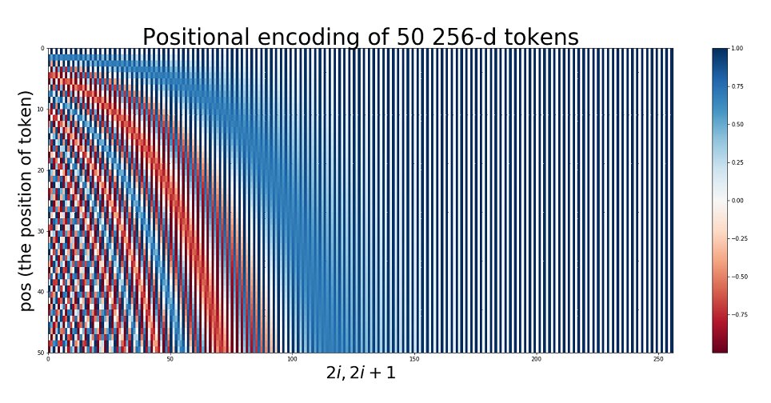
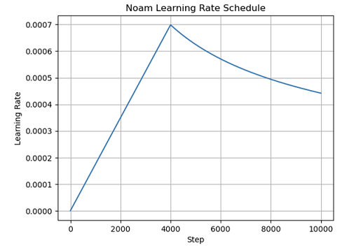

# 🤖 SGB-Chat

대한민국 군 병영시설 중 하나인 *사이버지식정보방(이하 사지방)* 에서 군 생활동안 **직접 개발**한 NumPy/MLX 기반 딥러닝 프레임워크인 [`💎Lucid`](https://github.com/ChanLumerico/lucid)의 실질적인 성능 검증을 위해 수행한 간단한 채팅용 Transformer 모델 학습

추가적으로 상대적으로 성능이 열악한, 외장 GPU 조차 있지 않은 사지방 PC의 CPU로 Transformer 모델을 학습시켜보고 싶은 약간의 도전정신(?) 또한 이 프로젝트를 진행하는 동기가 됨.

---

## ✨ Transformer

Tranformer는 시퀀스 입력을 처리하기 위해 **순환 구조(RNN)** 없이 전적으로 **어텐션(Attention)** 메커니즘과 **병렬 연산** 에 의존하는 인코더-디코더(Encoder-Decoder) 아키텍처이다.

원 논문은 [*"Attention Is All You Need" (Vaswani et al., 2017)*](https://arxiv.org/pdf/1706.03762) 이며, 핵심 철학은 다음과 같다:

1. 입력 토큰(token)을 고정 차원의 벡터 공간로 **임베딩(embedding)** 한다.
2. 시퀀스 내에서 각 위치가 다른 위치를 *'얼마나 볼지(attend)'* 를 학습적으로 결정한다. (Self-Attention)
3. 이 과정을 **여러 헤드(head)로 병렬화** 하여 다양한 표현 하위공간을 본다 (Multi-Head Attention).
4. **인코더** 는 입력 문장 표현을 만드는 역할, **디코더** 는 그 표현을 조건으로 출력 문장을 생성하는 역할을 한다.
5. 모든 것은 *Residual Connection + LayerNorm* 으로 안정화된다.

### 1️⃣ Embedding

#### 🔹 What for?

자연어의 단어(또는 sub-word 토큰)는 **정수 ID** 로 표현된다. 예를 들어

$$
\mathbf{x}=\left[\text{'나는'},~\text{'밥을'},~\text{'먹는다'}\right]\quad\rightarrow\quad\left[1032, ~481,~77\right]
$$

처럼 vocabularay index가 된다.

하지만 신경망은 정수 index 자체에는 직접적으로 의미를 부여할 수 없다. 그래서 각 토큰 ID를 *학습 가능한(learnable) 고차원 벡터* 로 매핑한다. 이 매핑을 **임베딩(embedding)** 이라 한다.

#### 🔸 Definition

어휘 집합(단어 집합)의 크기를 $V$, 임베딩 차원을 $d_{model}$이라고 하자.

- 임베딩 행렬(Embedding Matrix):

$$
\mathbf{E}\in\mathbb{R}^{V\times d_{model}}
$$

- 입력 시퀀스 길이를 $T$라 하면, one-hot 벡터 $\mathbf{o}_t\in\mathbb{R}^V$ (단어 인덱스에만 $1$, 나머지 $0$)를 곱해 임베딩을 얻는다:

$$
\mathbf{e}_t=\mathbf{o}_t^\top\mathbf{E}\in\mathbb{R}^{d_{model}}
$$

  실제로 구현은 one-hot을 만들지 않고 그냥 `E[token_id]`를 가져오는 gather 연산을 취한다.

전체 시퀀스를 모으면:

$$
\mathbf{X}_{emb}=\left[\mathbf{e}_1~\mathbf{e}_2~\cdots~\mathbf{e}_T\right]^\top\in\mathbb{R}^{T\times d_{model}}
$$

#### 🔹 Scaling

원 논문에서는 임베딩에 $\sqrt{d_{model}}$를 곱해준다:

$$
\mathbf{X}_{emb,~scaled}=\sqrt{d_{model}}~\cdot~\mathbf{X}_{emb}
$$

그 이유는 어텐션에 들어가기 전, *위치 정보(Positional Encoding)* 를 더하는데 두 값의 scale를 비슷하게 맞춰 **학습을 안정화시키기 위함** 이다.

### 2️⃣ Positional Encoding

#### 🔹 What for?

Transformer는 RNN처럼 순차적으로 처리하지 않는다. 즉, 토큰 순서를 구조적으로 ***모른다***.

따라서 모델이 예를 들어 *"3번째 단어는 2번째 단어 다음에 온다"* 같은 순서 정보를 알 수 있게, 각 위치 $t$에 대해 **위치 인코딩 벡터** $\text{PE}(t)$를 만들어 임베딩에 더해준다.

$$
\mathbf{Z}_t=\mathbf{X}_{emb,~t}+\text{PE}(t)\in\mathbb{R}^{d_{model}}
$$

#### 🔸 Sine/Cosine-Based Absolute Positional Encoding

$$
\text{PE}(t)=
\begin{cases}
\sin\left({\frac{t}{10000^{i/d_{model}}}}\right)\quad &\text{if}~i\mod 2=0 \\
\cos\left({\frac{t}{10000^{i/d_{model}}}}\right)\quad &\text{if}~i\mod 2=1 \\
\end{cases}
$$

- $t$: 시퀀스 내 위치 $(0, 1, 2, \ldots)$
- $i$: 채널 인덱스 $(0, 1, 2, \ldots)$
- 짝수 채널에는 $\sin$, 홀수 채널에는 $\cos$

이를 직관적으로 해석하자면:

- 분모 $10000^{2i/d_{model}}$는 채널마다 다른 주파수(frequency)을 준다.
- 즉, 어떤 차원은 *"느리게 변하는 위치 정보"*, 어떤 차원은 *"빠르게 변하는 미세 위치 정보"* 를 담는다.
- 이 조합으로 모델은 상대적 거리 정보까지 유추할 수 있다.

  즉, $\text{PE}(t+k)-\text{PE}(t)$가 일정한 구조를 갖는다 $\rightarrow$ $k$ 만큼 떨어져 있음 을 계산 가능하다.

#### 🔹 Implementation Perspective

최종 입력은

$$
\mathbf{Z}=\mathbf{X}_{emb,~scaled}+\text{PE}\in\mathbb{R}^{T\times d_{model}}
$$

이 $\mathbf{Z}$가 Encoder/Decoder 블록으로 들어가는 최소 시퀀스 표현이 된다.

### 3️⃣ Multi-Head Self-Attention

Self-Attention은 시퀀스 안의 각 위치가, 같은 시퀀스의 다른 위치들을 **바라보고(attend) 가중합(weighted-sum)** 을 만드는 과정이다.

#### 🔹 Core Idea

토큰 $t$의 표현이, 전체 토큰들과의 관계를 반영하도록 만든다. 예를 들어, 대명사 'it'이라는 단어가 문장 내에서 가리키는 대상(antecedent)을 찾는 데 유리하다.

#### 🔸 Query/Key/Value (Q, K, V)

각 입력 벡터 $\mathbf{z}_t$ 에 대해, 세 개의 서로 다른 **선형 변환(linear transformation)** 을 적용한다.

$$
\mathbf{q}_t=\mathbf{z}_t\mathbf{W}^Q,\quad\mathbf{k}_t=\mathbf{z}_t\mathbf{W}^K,\quad\mathbf{v}_t=\mathbf{z}_t\mathbf{W}^V
$$

여기서

$$
\mathbf{W}^Q\in\mathbb{R}^{d_{model}\times d_k},\quad\mathbf{W}^K\in\mathbb{R}^{d_{model}\times d_k},\quad\mathbf{W}^V\in\mathbb{R}^{d_{model}\times d_v}
$$

보통 $h$가 헤드 수일 때, $d_k=d_v=d_{model}/h$이다.

행렬 형태로 쓰명, 입력 전체를 모아

$$
\mathbf{Z}\in\mathbb{R}^{T\times d_{model}}
$$

이면 다음과 같다:

$$
\mathbf{Q}=\mathbf{Z}\mathbf{W}^Q\in\mathbb{R}^{T\times d_k},\quad
\mathbf{K}=\mathbf{Z}\mathbf{W}^K\in\mathbb{R}^{T\times d_k},\quad
\mathbf{V}=\mathbf{Z}\mathbf{W}^V\in\mathbb{R}^{T\times d_v}
$$

#### 🔹 Attention Score

토큰 $t$가 토큰 $u$를 *"얼마나 볼지(attend)"* 는 두 벡터의 **유사도(similarity)** 로 결정한다.

유사도는 $\mathbf{q}_t$와 $\mathbf{k}_u$의 내적(dot-product)으로 계산한다:

$$
S_{t,u}=\mathbf{q}_t\cdot\mathbf{k}_u^\top,\quad \mathbf{S}=\mathbf{Q}\mathbf{K}^\top\in\mathbb{R}^{T\times T}
$$

하지만 차원이 커질수록 내적 값이 커져서 softmax가 **saturate** 되기 쉬우므로 $\sqrt{d_k}$로 나눠준다.

$$
\mathbf{S}_{scaled}=\frac{\mathbf{Q}\mathbf{K}^\top}{\sqrt{d_k}}
$$

#### 🔸 Masking

- **인코더 Self-Attention**: 일반적으로 마스크 없이 모든 위치가 서로 볼 수 있다.
- **디코더 Self-Attention**: 미래 시점의 단어를 참조하면 안 되므로 *causal mask* 를 사용한다.

Causal Mask $\mathbf{M}$은

$$
M_{t,s}=
\begin{cases}
0\quad &s\le t \\
-\infty\quad &s> t
\end{cases}
$$

이것을 $\mathbf{S}_{scaled}$에 더해서 미래 위치에 대한 softmax 확률이 $0$이 되게 만든다.

$$
\tilde{\mathbf{S}}=\frac{\mathbf{Q}\mathbf{K}^\top}{\sqrt{d_k}}+\mathbf{M}
$$

#### 🔹 Attention Softmax

각 query 위치 $t$별로 softmax를 취해 확률 분포를 얻는다.

$$
\alpha_{t,s}=\frac{\exp(\tilde{S}_{t,s})}{\sum_{u=1}^T\exp(\tilde{S}_{t,u})}
\quad\Rightarrow\quad
\mathbf{A}=\text{softmax}(\tilde{\mathbf{S}})\in\mathbb{R}^{T\times T}
$$

이 $\mathbf{A}$는 $t$ 번째 토큰이 $s$ 번째 토큰에 얼마나 집중(attend)하는가 를 나타내는 **attention matrix** 이다.

#### 🔸 Output Vector via Weighted-Sum

이게 각 위치 $t$의 최종 표현은 value들의 가중합:

$$
\mathbf{o}_t=\sum_{s=1}^T\alpha_{t,s}\mathbf{v}_s,\quad \mathbf{O}=\mathbf{A}\mathbf{V}\in\mathbb{R}^{T\times d_v}
$$

이것이 한 개의 어텐션 헤드(head) 결과다.

#### 🔹 Multi-Head Attention

단일 헤드만 사용하면 모델은 한 종류의 관계 패턴만 볼 수 있다.

여러 헤드를 두고 서로 다른 $\mathbf{W}^Q,\mathbf{W}^K,\mathbf{W}^V$를 학습시키면 문법적 관계, 의미적 관계, 위치적 관계 등 서로 다른 시각을 병렬로 볼 수 있다.

각 헤드 $i\in\{1,\ldots,h\}$의 output을 계산하고

$$
\text{head}_i=\text{Attention}\left(\mathbf{Z}\mathbf{W}^Q_i,\mathbf{Z}\mathbf{W}^K_i,\mathbf{Z}\mathbf{W}^V_i\right)\in\mathbb{R}^{T\times d_v}
$$

그 다음 모든 헤드를 concatenate 한다.

$$
\text{Concat}\left(\text{head}_1,\ldots,\text{head}_h\right)\in\mathbb{R}^{T\times(h\cdot d_v)}
$$

마지막으로 이를 다시 원래 차원 $d_{model}$로 투사(projection) 시킨다.

$$
\text{MHA}(\mathbf{Z})=\text{Concat}\left(\text{head}_1,\ldots,\text{head}_h\right)\mathbf{W}^O\in\mathbb{R}^{T\times d_{model}}
$$

여기서 $\mathbf{W}^O\in\mathbb{R}^{(h\cdot d_v)\times d_{model}}$이다.

요약하자면, Multi-Head Self-Attention은

$$
\text{MHA}(\mathbf{Z})=\text{Concat}\left(\text{head}_1,\ldots,\text{head}_h\right)\mathbf{W}^O
$$

$$
\text{where}\quad\text{head}_i=\text{softmax}\left(\frac{\mathbf{Z}\mathbf{W}^Q_i(\mathbf{Z}\mathbf{W}^K_i)^\top}{\sqrt{d_k}}+\mathbf{M}\right)\left(\mathbf{Z}\mathbf{W}^V_i\right)
$$

### 4️⃣ Encoder

Transformer Encoder는 동일한 블록을 $N$번 반복한 stack이다. 각 블록은 **두 개의 핵심 sub-layer** 로 구성된다:

1. Multi-Head Self-Attention
2. Position-wise Feed-Forward-Network(FFN)

각 sub-layer에는 **Residual Connection + LayerNorm** 이 있다.

텍스트로 표현하자면 인코더 레이어 하나는:

1. 입력 $\mathbf{Z}^{(l)}$ $\rightarrow$ MHA $\rightarrow$ Dropout $\rightarrow$ Residual Add $\rightarrow$ LayerNorm $\rightarrow$ $\mathbf{H}^{(l)}$

2. $\mathbf{H}^{(l)}$ $\rightarrow$ FFN $\rightarrow$ Dropout $\rightarrow$ Residual Add $\rightarrow$ LayerNorm $\rightarrow$ $\mathbf{Z}^{(l+1)}$

여기서 $l$은 레이어 인덱스이다.

#### 🔹 Residual + LayerNorm

한 sub-layer를 함수 $\text{sublayer}(\cdot)$라고 할 때,

$$
\text{LayerOutput} = \text{LayerNorm}\left(\mathbf{X}+\text{Dropout}\left(\text{sublayer}\left(\mathbf{X}\right)\right)\right)
$$

Residual은 gradient 흐름을 **안정화** 시켜 deep-stack 학습을 돕는다.

LayerNorm은 **채널 차원 기준 정규화(regularization)** 으로, 각 토큰 벡터를 평균 $0$, 분산 $1$ 근처로 맞춰 **분포 폭주(explosion)** 를 막는다.

LayerNorm은 입력 $\mathbf{u}\in\mathbb{R}^{d_{model}}$에 대해:

$$
\text{LayerNorm}(\mathbf{u})=\gamma\odot\frac{\mathbf{u}-\mu}{\sqrt{\sigma^2+\epsilon}}+\beta
$$

여기서

$$
\mu=\frac{1}{d_{model}}\sum_{j=1}^{d_{model}}u_j,\quad\sigma^2=\frac{1}{d_{model}}\sum_{j=1}^{d_{model}}(u_j-\mu)^2
$$

이고, $\gamma,\beta\in\mathbb{R}^{d_{model}}$은 학습 가능한(learnable) 파라미터이다.

#### 🔸 Position-wise Feed-Forward-Network(FFN)

각 위치(토큰)별로 독립적으로 적용되는 2층 MLP:

$$
\text{FFN}(\mathbf{h})=\max(0,\mathbf{h}\mathbf{W}_1+\mathbf{b}_1)\mathbf{W}_2+\mathbf{b}_2
$$

보통 차원 확장 후 축소하는 과정을 거친다.

$$
\mathbf{W}_1\in\mathbb{R}^{d_{model}\times d_{ff}},\quad\mathbf{W}_2\in\mathbb{R}^{d_{ff}\times d_{model}}
$$

여기서 $d_{ff}$ (예: 2048)은 $d_{model}$ (예: 512)보다 훨씬 크게 잡는다. 이는 토큰별 **비선형 변환(non-linear transformation)** 능력을 강화시킨다.

행렬 형태로, 시퀀스 전체 $\mathbf{H}\in\mathbb{R}^{T\times d_{model}}$에 대해:

$$
\text{FFN}(\mathbf{H})=\text{ReLU}\left(\mathbf{H}\mathbf{W}_1+\mathbf{b}_1\right)\mathbf{W}_2+\mathbf{B}_2\in\mathbb{R}^{T\times d_{model}}
$$

#### 🔹 Encoder Layer Summary

한 인코더 레이어 $l$는 다음 과정으로 진행된다:

1. **Self-Attention Sub-Layer**

$$
\mathbf{U}^{(l)}=\text{LayerNorm}\left(\mathbf{Z}^{(l)}+\text{Dropout}\left(\text{MHA}\left(\mathbf{Z}^{(l)}\right)\right)\right)
$$

2. **FFN Sub-Layer**

$$
\mathbf{Z}^{(l+1)}=\text{LayerNorm}\left(\mathbf{U}^{(l)}+\text{Dropout}\left(\text{FFN}\left(\mathbf{U}^{(l)}\right)\right)\right)
$$

여기서 $\mathbf{Z}^{(0)}=\mathbf{Z}=\mathbf{Z}_{emb,~scaled}+\text{PE}$이다.

최종 인코더 출력:

$$
\text{EncOut}=\mathbf{Z}^{(N)}\in\mathbb{R}^{T\times d_{model}}
$$

은 디코더로 넘어가서 *"인풋 문장의 의미 요약"* 으로 쓰인다.

### 5️⃣ Decoder

디코더는 언어 생성 및 번역 등에 사용된다. 인코더와 작동 방식은 비슷하지만, 한 layer마다 sub-layer가 **3개씩** 존재한다.

1. Masked Multi-Head Self-Attention *(미래 토큰 차단)*
2. Cross-Attention *(인코더 출력과 attending)*
3. Position-wise FFN

인코더와 마찬가지로 모든 sub-layer는 **Residual Connection + LayerNorm** 의 형태이다.

#### 🔹 Decoder Input

타겟 시퀀스의 토큰을 임베딩하고 positional encoding을 더한다. 이걸 $\mathbf{Y}^{(0)}\in\mathbb{R}^{T_{tgt}\times d_{model}}$이라 하자.

#### 🔸 Masked Self-Attention

인코더의 self-attention과 동일하지만, 미래 단어를 보지 못하게 causal mask $\mathbf{M}_{causal}$를 적용한다. 즉, 디코더가 시점 $t$ 단어를 예측할 때, $t+1,t+2,\ldots$를 **참조할 수 없게** 된다.

수식은 인코더 self-attention과 동일하되 $\mathbf{M}_{causal}$ 마스크를 상용한다.

이 결과에 **Residual + LayerNorm** 를 적용한다.

$$
\mathbf{U}^{(l)}_1=\text{LayerNorm}\left(\mathbf{Y}^{(l)}+\text{Dropout}\left(\text{MaskedMHA}\left(\mathbf{Y}^{(l)}\right)\right)\right)
$$

#### 🔹 Cross-Attention

이 단계가 디코더가 인코더를 attend하는 부분이다.

여기서 Query는 디코더의 중간 표현(intermediate representation)에서 오고, Key/Value는 인코더 출력에서 온다.

- 디코더 중간 표현: $\mathbf{U}_1^{(l)}$
- 인코더 출력: $\text{EncOut}$

$$
\begin{aligned}
\mathbf{Q}=\mathbf{U}_1^{(l)}\mathbf{W}_{dec}^Q\quad&\in\quad\mathbb{R}^{T_{tgt}\times d_k} \\
\mathbf{K}=\text{EncOut}\mathbf{W}_{enc}^K\quad&\in\quad\mathbb{R}^{T_{src}\times d_k} \\
\mathbf{V}=\text{EncOut}\mathbf{W}_{enc}^V\quad&\in\quad\mathbb{R}^{T_{src}\times d_v} \\
\end{aligned}
$$

Self-Attention과 동일한 방식으로 softmax를 거친 뒤 가중합을 구한다.

Multi-Head인 경우 마찬가지로 head별로 위의 연산을 하고 **Concatenation + Linear Transformation** 을 거친다.

그 다음엔 인코더 출력과 cross attention을 진행한다.

$$
\mathbf{U}^{(l)}_2=\text{LayerNorm}\left(\mathbf{U}^{(l)}_1+\text{Dropout}\left(\text{CrossMHA}\left(\mathbf{U}^{(l)}_1,\text{EncOut}\right)\right)\right)
$$

직관적으로 이해해보자면:

- 디코더는 지금까지 생성한 **단어 맥락** ($\mathbf{U}_1^{(l)}$)을 가지고
- 인코더가 이해한 **소스 문장** ($\text{EncOut}$) 중 어디를 참고할지 동적으로 *"포인팅"* 한다.

#### 🔸Feed-Forward Network(FFN)

인코더와 동일한 position-wise FFN을 거쳐 디코더 레이어 $l$의 출력을 만든다.

$$
\mathbf{Y}^{(l+1)}=\text{LayerNorm}\left(\mathbf{U}^{(l)}_2+\text{Dropout}\left(\text{FFN}\left(\mathbf{U}^{(l)}_2\right)\right)\right)
$$

#### 🔹 Decoder Stack and Final Logit

이 디코더 레이러를 $N$번 반복 후 최종 출력 $\mathbf{Y}^{(N)}\in\mathbb{R}^{T_{tgt}\times d_{model}}$를 얻는다.

이것을 vocab 크기 $V$로 projection 해서 각 시점의 단어 분포(logits)를 만든다.

$$
\text{Logits}=\mathbf{Y}^{(N)}\mathbf{W}^{\text{vocab}}+\mathbf{b}^{\text{vocab}}\in\mathbb{R}^{T_{tgt}\times V}
$$

이후, softmax를 이용해 다음 단어의 확률을 구한다.

$$
P(\text{token}_t=v\mid\text{context})=\frac{\exp\left(\text{Logits}_{t,v}\right)}{\sum_{u=1}^V\exp\left(\text{Logits}_{t,u}\right)}
$$

학습 시에는 **teacher forcing** 으로 정답 시퀀스를 한 시점씩 shift하여 다음 토큰을 예측하게 하고, Cross-Entorypy Loss를 사용한다.

$$
\mathcal{L} = -\sum_{t=1}^{T_{tgt}} \log P\big( y_t^{\star} \mid y_{< t}^{\star}, \mathrm{EncOut} \big)
$$

여기서 $y_t^*$는 정답 토큰이다.

### ✅ Transformer Summary

1. **Embedding**

   단어 ID $\rightarrow$ 연속 벡터 표현, $\mathbb{R}^{V\times d_{model}}$ 임베딩 행렬로 lookup 후 스케일 $\sqrt{d_{model}}$ 곱함.

2. **Positional Encoding**

   순서를 모르는 Self-Attention에게 위치 정보를 주기 위해 $\sin,\cos$ 주파수 기반 벡터 $\text{PE}(t)$를 더함.

3. **Multi-Head Self-Attention**

   각 위치가 전체 시퀀스의 다른 위치를 attend하고 가중합을 만들도록 서로 다른 시각(head)을 병렬로 학습.

$$
\text{Attention}(\mathbf{Q},\mathbf{K},\mathbf{V})=\text{softmax}\left(\frac{\mathbf{Q}\mathbf{K}^\top}{\sqrt{d_k}}\right)\mathbf{V}
$$

4. **Encoder**

   (Self-Attention $\rightarrow$ FFN) + Residual + LayerNorm을 $N$층 쌓아 입력 문장을 풍부한 표현 공간(representation space)로 인코딩.

5. **Decoder**

   (Masked Self-Attention $\rightarrow$ Cross-Attention with Encoder $\rightarrow$ FFN) + Residual + LayerNorm을 $N$층 쌓아 한 토큰씩 생성, 마지막은 vocab projection으로 확률 분포 계산.

---

## 📋 Prerequisites

### 📊 SGB PC Specs

군 복무를 하였던 자대 내 사지방의 PC 사양은 다음과 같다.

| 항목      | 수치                         |
|-----------|------------------------------|
| **CPU**   | Intel Core i5-8600 @ 3.10GHz |
| **FLOPS** | 297.6 GFLOPS (FP32)          |
| **RAM**   | 8GB                          |

### 📚 Dataset

학습할 데이터셋으로는 *songys* 님의 GitHub 레포지토리 [`Chatbot_data`](https://github.com/songys/Chatbot_data)에 업로드 되어있는 소규모의 한국어 문답 데이터셋을 사용하였다. 

- 총 데이터 수: **11,823**
- 총 단어 수: **8,192**

**예시 데이터 샘플**

```txt
Q: 스터디 하는데 괜찮은 사람 있어?
A: 하라는 공부는 안하고!
```

```txt
Q: 사업 시작해도 될까?
A: 확신이 있을 때 시작해보세요.
```

### 🧰 Model Configurtation

학습할 모델은 다음과 같은 구성(config)을 가진 모델을 사용하였다.

| 구성             | 값          |
|------------------|-------------|
| **Type**         | Transformer |
| **# of Layers**  | 2           |
| **# of Heads**   | 8           |
| **$d_{model}$**  | 256         |
| **$d_{ff}$**     | 512         |
| **Dropout Rate** | 0.1         |

### 🚀 Training Hyperparameters

모델 학습에 대한 하이퍼파라미터는 다음과 같다.

| 하이퍼파라미터           | 값             |
|-------------------------|----------------|
| **# of Epochs**         | 50             |
| **Batch Size**          | 64             |
| **Valid Ratio**         | 0.1            |
| **Max Seq. Length**     | 40             |
| **Optimizer**           | Adam           |
| **Scheduler**           | Noam Scheduler |
| **LR Warmup-Steps**     | 4000           |
| **Grad Clip Value**     | 1.0            |
| **Early Stop Patience** | 5              |

---

## 💻 Code Implementation

### 0️⃣ Module Import

```python
import os
import math
from pathlib import Path

# Lucid 버전 2.7.8
import lucid
import lucid.nn as nn
import lucid.nn.functional as F
import lucid.optim as optim

from lucid.data import TensorDataset, DataLoader, random_split
from lucid.models.util import summarize
from lucid._tensor import Tensor

# 데이터 전처리용 토크나이저 라이브러리
from tokenizers import Tokenizer

import pandas as pd
import matplotlib.pyplot as plt

from tqdm import tqdm
```

재구현을 위한 전역 랜덤 시드는 `42`, 디바이스는 `"cpu"`를 사용하였다.

```python
lucid.random.seed(42)

device: lucid.types._DeviceType = "cpu"
```

### 1️⃣ Positional Encoding Class

앞서 설명한 위치 인코딩(positional encoding)을 구현하였다.

```python
class PositionalEncoding(nn.Module):
    def __init__(self, d_model: int, dropout: float = 0.1, max_len: int = 5000) -> None:
        super().__init__()
        self.dropout = nn.Dropout(dropout)

        pe = lucid.zeros(max_len, d_model)
        position = lucid.arange(0, max_len, dtype=lucid.Float32).unsqueeze(axis=1)
        div_term = lucid.exp(
            lucid.arange(0, d_model, 2, dtype=lucid.Float32)
            * (-lucid.log(1e4) / d_model)
        )

        pe[:, 0::2] = lucid.sin(position * div_term)
        pe[:, 1::2] = lucid.cos(position * div_term)

        pe = pe.unsqueeze(axis=0)
        self.register_buffer("pe", pe)

    def forward(self, x: Tensor) -> Tensor:
        seq_len = x.shape[1]
        x += self.pe[:, :seq_len, :]
        return self.dropout(x)
```

256차원의 positional encoding 값을 시각적으로 나타내면 다음과 같은 패턴이 나타난다.



### 2️⃣ Transformer Class

```python
class Transformer(nn.Module):
    def __init__(
        self,
        src_vocab_size: int,
        tgt_vocab_size: int,
        d_model: int = 512,
        dim_feedforward: int = 2048,
        num_heads: int = 8,
        num_encoder_layers: int = 6,
        num_decoder_layers: int = 6,
        dropout: float = 0.1,
        pad_id: int = 0,
        tie_weights: bool = True,
    ) -> None:
        super().__init__()
        self.d_model = d_model
        self.pad_id = pad_id

        self.src_embedding = nn.Embedding(src_vocab_size, d_model, padding_idx=pad_id)
        self.tgt_embedding = nn.Embedding(tgt_vocab_size, d_model, padding_idx=pad_id)

        self.positional_encoder = PositionalEncoding(d_model, dropout, max_len=5000)

        self.transformer = nn.Transformer(
            d_model=d_model,
            num_heads=num_heads,
            num_encoder_layers=num_encoder_layers,
            num_decoder_layers=num_decoder_layers,
            dim_feedforward=dim_feedforward,
            dropout=dropout,
        )

        self.out = nn.Linear(d_model, tgt_vocab_size, bias=not tie_weights)
        if tie_weights:
            self.out.weight = self.tgt_embedding.weight

        self.reset_parameters()

    def reset_parameters(self) -> None:
        for m in self.modules():
            if isinstance(m, nn.Linear):
                nn.init.xavier_uniform(m.weight)
                if m.bias is not None:
                    nn.init.constant(m.bias, 0.0)
            elif isinstance(m, nn.Embedding):
                nn.init.normal(m.weight, mean=0.0, std=1.0)

    @staticmethod
    def _mask_padding_mask(tokens: Tensor, pad_id: int) -> Tensor:
        return tokens == pad_id

    @staticmethod
    def _mask_square_subseq_mask(sz: int) -> Tensor:
        return lucid.triu(lucid.full((sz, sz), -lucid.inf), diagonal=1)

    def forward(
        self,
        src: Tensor,
        tgt: Tensor,
        tgt_mask: Tensor | None = None,
        src_pad_mask: Tensor | None = None,
        tgt_pad_mask: Tensor | None = None,
    ) -> Tensor:
        device = src.device

        scale = self.d_model ** 0.5
        src_emb = self.src_embedding(src) * scale
        tgt_emb = self.tgt_embedding(tgt) * scale

        src_emb = self.positional_encoder(src_emb)
        tgt_emb = self.positional_encoder(tgt_emb)

        if tgt_mask is None:
            T = tgt_emb.shape[1]
            tgt_mask = self._mask_square_subseq_mask(T).to(device)

        if src_pad_mask is None:
            src_pad_mask = self._mask_padding_mask(src, self.pad_id)
        if tgt_pad_mask is None:
            tgt_pad_mask = self._mask_padding_mask(tgt, self.pad_id)

        x = self.transformer(
            src=src_emb,
            tgt=tgt_emb,
            tgt_mask=tgt_mask,
            src_key_padding_mask=src_pad_mask,
            tgt_key_padding_mask=tgt_pad_mask,
            mem_key_padding_mask=src_pad_mask,
        )

        logits = self.out(x)
        return logits
```

여기서 **완전 연결 레이어(FC Layer)** 모듈 `nn.Linear`의 가중치 초기화는 **Xavier Uniform** 방식을 사용하였다.

#### 💡 Xavier Uniform Initialization

신경망의 각 층에서 입력과 출력의 **분산(variance)** 을 일정하게 유지하기 위해 고안된 초기화 방법이다.

가중치 초기와를 잘못할 경우 다음과 같은 문제가 발생한다:

- **기울기 소멸(Gradient vanishing)**: 값이 너무 작아지며 학습이 *정체(stagnate)* 됨
- **기울기 폭발(Gradient explosion)**: 값이 너무 커져 학습이 *불안정(unstable)* 해짐

입력 차원을 $n_{in}$, 출력 차원을 $n_{out}$이라고 하면 $W_{ij}$는 다음과 같이 초기화된다.

$$
W_{ij}\sim\mathcal{U}(-a,a),\quad\text{where}\quad a=\sqrt{\frac{6}{n_{in}+n_{out}}}
$$

임베딩 레이어 모듈 `nn.Embedding`의 가중치 초기화는 표준정규분포( $\mathcal{N}(0,1)$ )를 사용하였다.

### 3️⃣ Noam Scheduler Class

```python
class NoamScheduler(optim.lr_scheduler.LRScheduler):
    def __init__(
        self,
        optimizer: optim.Optimizer,
        d_model: int,
        warmup_steps: int = 4000,
        last_epoch: int = -1,
    ) -> None:
        super().__init__(optimizer, last_epoch)
        self.d_model = d_model
        self.warmup_steps = warmup_steps

    def get_lr(self) -> list[float]:
        step = max(1, self._step_count)
        scale = self.d_model ** -0.5
        
        arg1 = step ** -0.5
        arg2 = step * self.warmup_steps ** -1.5

        lr = scale * min(arg1, arg2)
        return [lr] * len(self.base_lrs)
```

Transformer에서 자주 쓰이는 **Noam Scheduler** 는 *"Attention Is All You Need"* 논문에서 처음 제안된 학습률(learning rate; LR) 스케쥴링 방식이다.

핵심 아이디어는 다음과 같다:

- 학습 초기에 LR을 점점 **증가(warmup)** 시켜서 모델이 안정적으로 학습하게 하고,
- 이후에는 step 수가 커질수록 LR을 점점 **감소(decay)** 시켜서 학습이 수렴(converge)하도록 만드는 방식이다.

$$
\text{lr}(\text{step})=d_{model}^{-0.5}\cdot\min\left(\text{step}^{-0.5},\text{step}\cdot\text{warmup}^{-1.5}\right)
$$

이를 그래프로 나타낸다면 다음과 같다.



### 4️⃣ Data Setup

우선 사전학습된 토크나이저 json 파일을 로드하였다.

```python
tokenizer = Tokenizer.from_file("../data/tokenizer.json")
vocab_size = tokenizer.get_vocab_size()
max_length = 40
```

다음으로 기본적인 특수 토큰들에 대한 ID를 부여하였다.

```python
PAD_ID = tokenizer.token_to_id("[PAD]")
START_ID = tokenizer.token_to_id("[START]")
END_ID = tokenizer.token_to_id("[END]")
```

이후, 소스(source)와 타겟(target) 데이터를 **토크나이즈(tokenize)** 한 전처리된 데이터를 로드하였다.

```python
src = lucid.load("../data/src.lct")
tgt = lucid.load("../data/tgt.lct")
```

그 다음, **teacher forcing** 을 위해 *1-토큰* shift된 디코더 인풋과 타겟 데이터셋를 생성하였다.

```python
dec_inputs = tgt[:, :-1]
dec_labels = tgt[:, 1:]

dataset = TensorDataset(src, dec_inputs, dec_labels)
dataset.to(device)
```

다음으로 훈련용 데이터셋과 검증용 데이터셋을 분리하였다.

```python
val_ratio = 0.1
n_total = len(dataset)
n_val = int(n_total * val_ratio)
n_train = n_total - n_val

train_set, valid_set = random_split(dataset, [n_train, n_val])
```

기본적인 모델 하이퍼파라미터는 다음과 같이 설정하였다.

```python
batch_size = 64
num_epochs = 50
num_layers = 2
d_model = 256
num_heads = 8
dim_feedforward = 512
dropout = 0.1
```

마지막으로, 학습에 사용될 `DataLoader` 인스턴스를 생성하였다.

```python
train_loader = DataLoader(train_set, batch_size=batch_size, shuffle=True)
valid_loader = DataLoader(valid_set, batch_size=batch_size, shuffle=False)
```

### 5️⃣ Model Construction

```python
model = Transformer(
    src_vocab_size=vocab_size,
    tgt_vocab_size=vocab_size,
    d_model=d_model,
    num_heads=num_heads,
    num_encoder_layers=num_layers,
    num_decoder_layers=num_layers,
    dim_feedforward=dim_feedforward,
    dropout=dropout,
).to(device)
```

`lucid.models` 내장 함수인 `summarize`를 이용해 모델 구조를 출력하면 다음과 같다.

```python
summarize(model, input_shape=[(1, max_length), (1, max_length)])
```

```txt
                                    Summary of Transformer                                     
===============================================================================================
Layer                               Input Shape           Output Shape          Parameter Size
===============================================================================================
Transformer                         (1, 40)               (1, 40, 8192)         8,928,256   
├── Linear                          (1, 40, 256)          (1, 40, 8192)         2,097,152   
├── Transformer                     None                  (1, 40, 256)          2,636,800   
├── TransformerDecoder              (1, 40, 256)          (1, 40, 256)          1,582,080   
│   ├── LayerNorm                   (1, 40, 256)          (1, 40, 256)          512         
│   │   ├── TransformerDecoderLa... (1, 40, 256)          (1, 40, 256)          790,784     
│   │   │   ├── LayerNorm           (1, 40, 256)          (1, 40, 256)          512         
│   │   │   ├── Dropout             (1, 40, 256)          (1, 40, 256)          -
│   │   │   ├── Linear              (1, 40, 512)          (1, 40, 256)          131,328     
│   │   │   ├── Dropout             (1, 40, 512)          (1, 40, 512)          -
│   │   │   ├── Linear              (1, 40, 256)          (1, 40, 512)          131,584     
│   │   │   ├── LayerNorm           (1, 40, 256)          (1, 40, 256)          512         
│   │   │   ├── Dropout             (1, 40, 256)          (1, 40, 256)          -
│   │   │   ├── MultiHeadAttention  (1, 40, 256)          (1, 40, 256)          263,168     
│   │   │   │   ├── Linear          (1, 40, 256)          (1, 40, 256)          65,792      
│   │   │   │   ├── Linear          (1, 40, 256)          (1, 40, 256)          65,792      
│   │   │   │   ├── Linear          (1, 40, 256)          (1, 40, 256)          65,792      
│   │   │   │   ├── Linear          (1, 40, 256)          (1, 40, 256)          65,792      
│   │   │   ├── LayerNorm           (1, 40, 256)          (1, 40, 256)          512         
│   │   │   ├── Dropout             (1, 40, 256)          (1, 40, 256)          -

                                   ... and more 59 layer(s)                                    
===============================================================================================
Total Layers(Submodules): 75
Total Parameters: 8,928,256 (8.93M)
Total FLOPs: 198,056,080 (198.06M)
===============================================================================================
```

이 프로젝트에 사용될 transformer 모델의 파라미터 수는 **8,928,256** 개 이다.

### 6️⃣ Loss Function

모델 학습을 위한 손실 함수를 다음과 같이 설정하였다.

트랜스포머 모델의 학습에서는 주로 *교차 엔트로피(cross-entropy)* 를 시퀀스 단위로 확장한 **Sequence Cross-Entropy** 를 사용한다.

#### 💡 Sequence Cross Entropy

단일 시점에서의 분류(classification) 문제에서 **교차 엔트로피 손실** 은 다음과 같이 정의된다.

$$
\mathcal{L}=-\sum_{c=1}^C y_c\log p_c
$$

- $C$: 클래스 개수
- $y_c$: 정답(one-hot) 벡터
- $p_c$: 모델의 예측 확률 (softmax 결과)

즉, 모델이 정답 클래스에 얼마나 확신을 가지는지를 음의 로그로 측정하는 것이다.

정답 클래스 $k$에 대해서는 단순히

$$
\mathcal{L}=-\log p_k
$$

가 된다.

트랜스포머는 단어 단위로 확률 분포를 출력한다.

입력 시퀀스가 $\mathbf{X}=\left(x_1,x_2,\ldots,x_T\right)$ 이고, 타겟 시퀀스가 $\mathbf{Y}=\left(y_1,y_2,\ldots,y_T\right)$ 라고 하면, 모델은 각 시점 $t$에서 확률 분포 $p_\theta\left(y_t\mid y_{<t}, \mathbf{X}\right)$ 를 예측한다.

그에 대한 **시퀀스 전체 손실** 은 다음과 같다.

$$
\mathcal{L}_{seqce}(\mathbf{X},\mathbf{Y};\theta)=-\frac{1}{T}\sum_{t=1}^T\log p_\theta\left(y_t\mid y_{<t},\mathbf{X}\right)
$$

- $T$: 시퀀스 길이
- $\theta$: 모델의 파라미터
- $y_{<t}$: 이전 단어들의 시퀀스

즉, 각 시점별 cross-entropy를 구한 뒤 평균을 낸 것이다. 이 식은 언어모델(Language Model; LM)이나 번역 모델의 **teacher forcing** 학습 시 매우 일반적으로 사용된다.

트랜스포머의 출력 로짓(logit) $z_t\in\mathbb{R}^C$ 에 대해 softmax를 취하면 다음과 같다.

$$
p_\theta\left(y_t=c\mid y_{<t},\mathbf{X}\right)=\frac{\exp(z_{t,c})}{\sum_{c'}\exp(z_{t,c'})}
$$

이를 손실에 대입하면:

$$
p_\theta\left(y_t = c \mid y_{<t}, \mathbf{X}\right)= \frac{\exp(z_{t,c})}{\sum_{c^{\prime}} \exp(z_{t,c^{\prime}})}
$$

이는 일반적인 **log-softmax** 형태의 손실과 동일하다.

시퀀스 데이터에서는 문장의 길이가 다르기 때문에, 보통 `[PAD]` 토큰으로 채운다. 이때 손실 계산 시 패딩 토큰을 무시해야 한다.

이를 위해 마스크 $m_t\in\{0,1\}$ 를 정의하면:

$$
\mathcal{L}_{seqce}=-\frac{1}{\sum_t m_t}\sum_{t=1}^T m_t\log p_\theta\left(y_t\mid y_{<t},\mathbf{X}\right)
$$

즉, **실제 단어** 에만 손실을 계산하고 평균을 낸다. 이를 코드로 구현하면 다음과 같다:

```python
def seq_ce_loss(logits: Tensor, targets: Tensor, pad_id: int = 0) -> Tensor:
    B, T, V = logits.shape
    logits_2d = logits.reshape(B * T, V)
    targets_1d = targets.reshape(B * T)

    loss = F.cross_entropy(
        logits_2d, targets_1d, reduction=None, ignore_index=pad_id  # 마스킹
    )

    valid = (targets_1d != pad_id).astype(lucid.Float32)
    return (loss * valid).sum() / (valid.sum() + 1e-8)
```

추가적으로 **정확도(accuracy)** 함수는 다음과 같이 구현하였다.

```python
@lucid.no_grad()
def token_accuracy(logits: Tensor, targets: Tensor, pad_id: int = 0) -> Tensor:
    preds = lucid.argmax(logits, axis=-1)
    mask = targets != pad_id
    
    correct = ((preds == targets) & mask).sum()
    total = mask.sum().item()
    return correct / max(1, total)
```

정확도는 단순 확인용 metric이므로 **gradient 트래킹을 정지** 한 채(`@lucid.no_grad()`) 계산한다.

다음으로, 일반적인 손실 계산을 위해 다음 함수 또한 추가하였다.

```python
@lucid.no_grad()
def evaluate_loss(model: nn.Module, dataloader: DataLoader, pad_id: int = 0) -> Tensor:
    model.eval()
    total, count = 0.0, 0
    for src, dec_inp, dec_out in dataloader:
        src, dec_inp, dec_out = src.to(device), dec_inp.to(device), dec_out.to(device)

        logits = model(
            src=src,
            tgt=dec_inp,
            src_pad_mask=(src == pad_id),
            tgt_pad_mask=(dec_inp == pad_id),
        )
        loss = seq_ce_loss(logits, dec_out, pad_id)

        total += loss
        count += 1
    return total / max(1, count)
```

### 7️⃣ Training

체크포인트를 저장하는 함수는 다음과 같다.

모델과 옵티마이저, 스케쥴러의 `state-dict`와 훈련(per batch/epoch) 간 쌓인 손실 값들을 같이 저장한다.

```python
def save_checkpoint(
    model: nn.Module,
    optimizer: optim.Optimizer,
    scheduler: optim.lr_scheduler.LRScheduler,
    epoch: int,
    epoch_loss: float,
    batch_losses: list[float],
    epoch_losses: list[float],
    val_epoch_losses: list[float] | None = None,
    path: Path = "../checkpoints",
) -> None:
    os.makedirs(path, exist_ok=True)
    checkpoint = dict(
        model_state_dict=model.state_dict(),
        optimizer_state_dict=optimizer.state_dict(),
        scheduler_state_dict=scheduler.state_dict() if scheduler else None,
        epoch=epoch,
        epoch_loss=epoch_loss,
        batch_losses=batch_losses,
        epoch_losses=epoch_losses,
        val_epoch_losses=val_epoch_losses,
    )
    lucid.save(checkpoint, os.path.join(path, f"epoch_{epoch}"))
```

저장된 체크포인트는 다음 함수로 불러온다.

```python
def load_latest_checkpoint(
    ckpt_dir: Path, 
    model: nn.Module, 
    optimizer: optim.Optimizer, 
    scheduler: optim.lr_scheduler.LRScheduler,
) -> tuple[int, list[float], list[float], list[float]]:
    if not os.path.exists(ckpt_dir):
        return 1, [], [], []
    
    ckpts = [f for f in os.listdir(ckpt_dir) if f.endswith(".lcd")]
    if not ckpts:
        return 1, [], [], []
    
    latest_ckpt = sorted(ckpts, key=lambda x: int(x.split("_")[1].split(".")[0]))[-1]
    checkpoint = lucid.load(os.path.join(ckpt_dir, latest_ckpt))

    model.load_state_dict(checkpoint["model_state_dict"])
    optimizer.load_state_dict(checkpoint["optimizer_state_dict"])

    if scheduler and checkpoint["scheduler_state_dict"]:
        scheduler.load_state_dict(checkpoint["scheduler_state_dict"])
    
    print(f"Loaded checkpoint from epoch {checkpoint["epoch"]}.")
    return (
        checkpoint["epoch"] + 1,
        checkpoint.get("batch_losses", []),
        checkpoint.get("epoch_losses", []),
        checkpoint.get("val_epoch_losses", []),
    )
```

모델 훈련 함수는 다음과 같이 구현하였다.

```python
def train(
    model: nn.Module,
    dataloader: DataLoader,
    optimizer: optim.Optimizer,
    scheduler: optim.lr_scheduler.LRScheduler | None = None,
    pad_id: int = 0,
    device: str = "cpu",
    epochs: int = 50,
    grad_clip: int | None = None,
    ckpt_dir: Path = "../checkpoints",
    start_epoch: int = 1,
    batch_losses: list[float] | None = None,
    epoch_losses: list[float] | None = None,
    val_loader: DataLoader | None = None,
    early_stop_patience: int | None = None,
) -> tuple[list[float], list[float], list[float]]:
    model.to(device)
    batch_losses = [] if batch_losses is None else list(batch_losses)
    epoch_losses = [] if epoch_losses is None else list(epoch_losses)

    val_epoch_losses = []
    best_val = float("inf")
    bad_epochs = 0

    for epoch in range(start_epoch, epochs + 1):
        model.train()
        total_loss, total_acc = 0.0, 0.0
        n_batches = len(dataloader)

        progress = tqdm(
            dataloader, desc=f"Epoch {epoch}/{epochs}", leave=True, ncols=100, dynamic_ncols=True
        )
        for step, (src, dec_inp, dec_out) in enumerate(progress, start=1):
            src, dec_inp, dec_out = src.to(device), dec_inp.to(device), dec_out.to(device)

            logits = model(
                src=src, tgt=dec_inp, src_pad_mask=src == pad_id, tgt_pad_mask=dec_inp == pad_id
            )
            loss = seq_ce_loss(logits, dec_out, pad_id)

            optimizer.zero_grad()
            loss.backward()
            if grad_clip:
                nn.util.clip_grad_norm(model.parameters(), max_norm=grad_clip)
            
            optimizer.step()
            if scheduler:
                scheduler.step()
            
            acc = token_accuracy(logits, dec_out, pad_id)
            total_loss += loss.item()
            total_acc += acc.item()
            batch_losses.append(loss.item())

            progress.set_postfix(
                {
                    "loss": f"{total_loss / step:.4f}",
                    "acc": f"{total_acc / step:.4f}",
                    "lr": f"{optimizer.param_groups[0]['lr']:.2e}",
                }
            )
        
        train_epoch_loss = total_loss / n_batches
        epoch_losses.append(train_epoch_loss)

        if val_loader is not None:
            val_loss = evaluate_loss(model, val_loader, pad_id=pad_id).item()
            val_epoch_losses.append(val_loss)

            print(
                f"Epoch {epoch}/{epochs} Valid Loss: {val_loss:.4f} | "
                f"Perplexity: {math.exp(val_loss)}"
            )

            if val_loss < best_val:
                best_val = val_loss
                bad_epochs = 0
            else:
                bad_epochs += 1
                if (early_stop_patience is not None) and (bad_epochs >= early_stop_patience):
                    print(
                        f"Early stopping at epoch {epoch} "
                        f"(no val. improvement for {bad_epochs} epochs)."
                    )
                    save_checkpoint(
                        model,
                        optimizer,
                        scheduler,
                        epoch,
                        train_epoch_loss,
                        batch_losses,
                        epoch_losses,
                        val_epoch_losses,
                        path=ckpt_dir,
                    )
                    return batch_losses, epoch_losses, val_epoch_losses
        
        save_checkpoint(
            model,
            optimizer,
            scheduler,
            epoch,
            train_epoch_loss,
            batch_losses,
            epoch_losses,
            val_epoch_losses,
            path=ckpt_dir,
        )

    return batch_losses, epoch_losses, val_epoch_losses
```

이후, 옵티마이저와 스케쥴러를 선언하였다.

```python
optimizer = optim.Adam(model.parameters(), lr=1.0, betas=(0.9, 0.98), eps=1e-9)
scheduler = NoamScheduler(optimizer, d_model=d_model, warmup_steps=4000)
```

본격적으로 transformer 모델 훈련을 진행해보자.

```python
start_epoch, batch_losses, epoch_losses, val_epoch_losses = load_latest_checkpoint(
    ckpt_dir="../checkpoints", model=model, optimizer=optimizer, scheduler=scheduler,
)

batch_losses, epoch_losses, val_epoch_losses = train(
    model,
    dataloader=train_loader,
    optimizer=optimizer,
    scheduler=scheduler,
    pad_id=PAD_ID,
    device=device,
    epochs=num_epochs,
    grad_clip=1.0,
    ckpt_dir="../checkpoints",
    start_epoch=start_epoch,
    batch_losses=batch_losses,
    epoch_losses=epoch_losses,
    val_loader=valid_loader,
    early_stop_patience=5,
)
```
